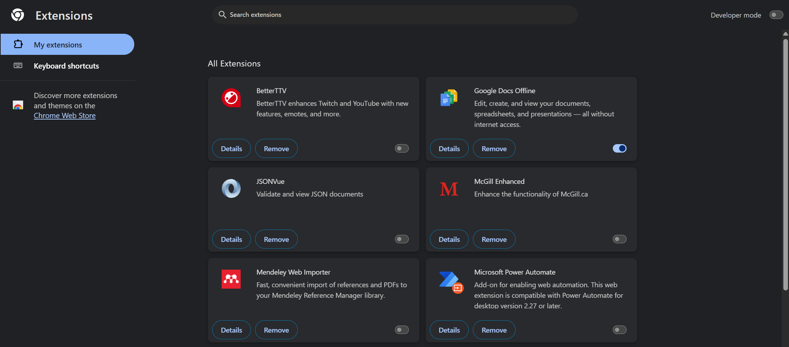
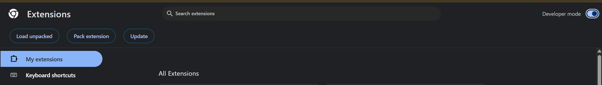
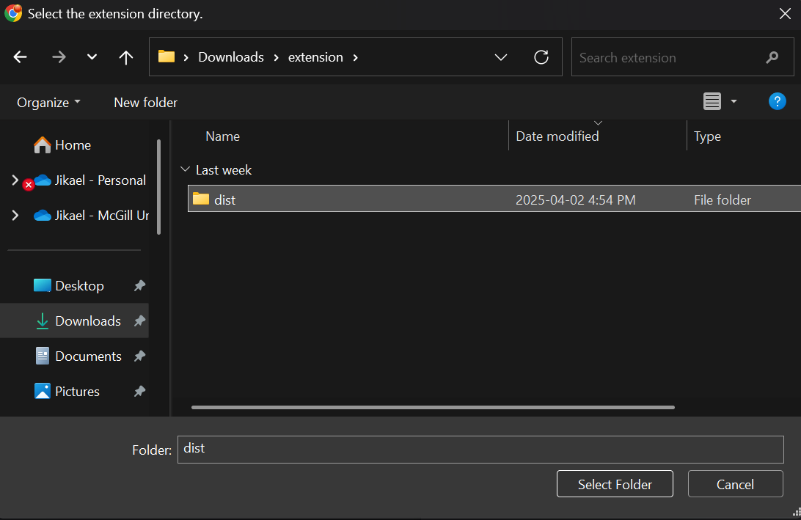
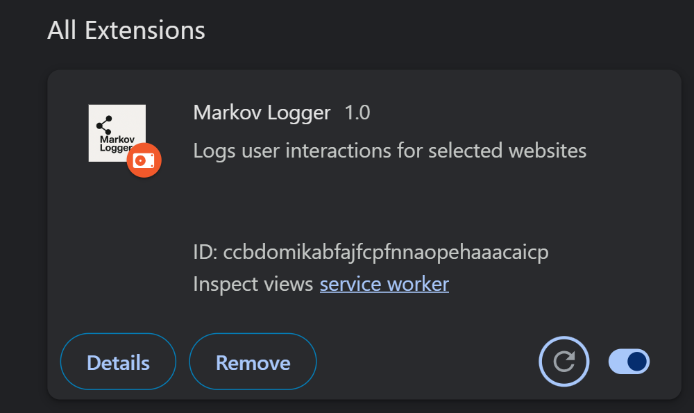
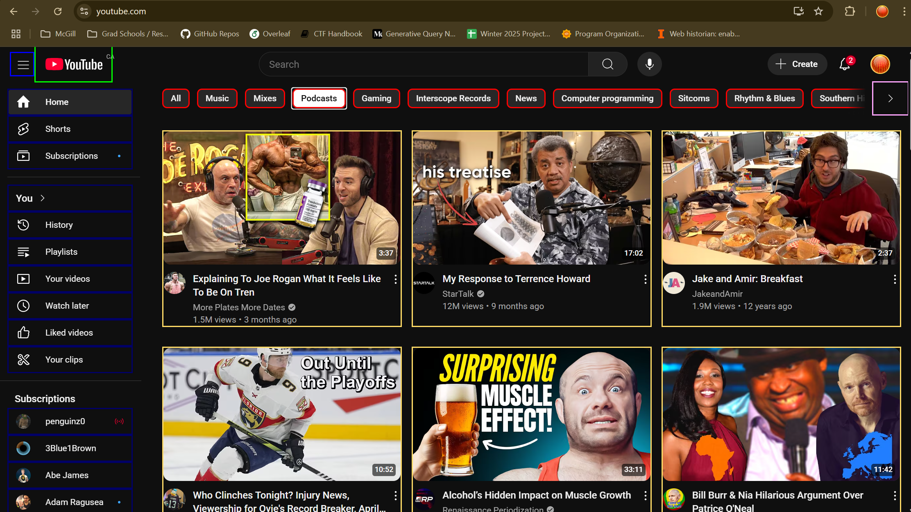

## Setup Instructions

### Setting up the extension

1. Locate the [dist](./dist/) folder in this project.
2. Open Chrome and navigate to [chrome://extensions](chrome://extensions/) You should see a page that looks like this:



3. In the top right corner, enable Developer mode:



4. Click on `Load Unpacked` and select the [dist](./dist/) folder:



5. Click "Select Folder" (on Windows) to upload it

6. You should now see Markov Logger in your extensions list:



7. Now go to [YouTube](https://youtube.com) and you should see the following:



### Setting up your development environment

This extension uses TypeScript and uses Webpack to compile modules. To make sure you have all the dependencies, first install [npm](https://nodejs.org/en/download). Once this is installed, simply run `npm install` in the terminal from the root directory of the project to install all dependencies.

Currently, the extension is just set up to work on YouTube. If you would like to test out TikTok or implement your own code, you can modify the content script to instantiate more monitors:

```ts
import { Monitor } from "./interactions/monitor"
import ytConfig from "./configs/youtube_config.json"
import tiktokConfig from "./configs/tiktok_config.json"
import { ConfigLoader } from "./interactions/config"

const ytConfigLoader = new ConfigLoader(ytConfig)
const ytInteractor = new Monitor(ytConfigLoader.config)

const tiktokIDSelector = (): string => {
  let vid = document.querySelector("div.xgplayer-container.tiktok-web-player")
  if (!vid) {
    console.log("no url found!")
    return ""
  }
  let id = vid.id.split("-").at(-1)
  let url = `https://tiktok.com/share/video/${id}`
  return url
}

// UNCOMMENT THESE LINES TO ALSO MONITOR TIKTOK

// console.log(tiktokConfig);
// const tiktokConfigLoader = new ConfigLoader(tiktokConfig);
// tiktokConfigLoader.addIDSelector("/*", tiktokIDSelector);
// const tiktokInteractor = new Monitor(tiktokConfigLoader.config);
```

Notably, if you intend to test new URLs, make sure to update the `matches` field in [dist/manifest.json](dist/manifest.json) to grant the extension permissions on the URL:

```json
{
  "manifest_version": 3,
  "name": "Markov Logger",
  "version": "1.0",
  "description": "Logs user interactions for selected websites",
  "content_scripts": [
    {
      "matches": [
        "https://www.youtube.com/*",
        "https://www.tiktok.com/*",
        "https://x.com/*"
      ],
      "js": ["content.bundle.js"]
    }
  ],
  "background": {
    "service_worker": "background.bundle.js"
  },
  "permissions": ["identity", "identity.email"]
}
```

Once you've implemented your changes, simply run `npx webpack` to bundle the modules, then open Chrome, go to [chrome://extensions](chrome://extensions) and click on the refresh button under the extension:


Your changes should now be visible.

### Accessing the Database

If you have access to the database, simply click on [this link](https://console.firebase.google.com/project/interactor-8f0f1/firestore/databases/-default-/data/~2FuserData~2F9iou6iFy1v6zryPQQdxR?fb_gclid=CjwKCAiAtsa9BhAKEiwAUZAszaBjl_SaPGRbJM7XgbL0TvvDZ_o0vTzFIh5eTFTM9sl3QRhbo11sjRoCcsQQAvD_BwE).
